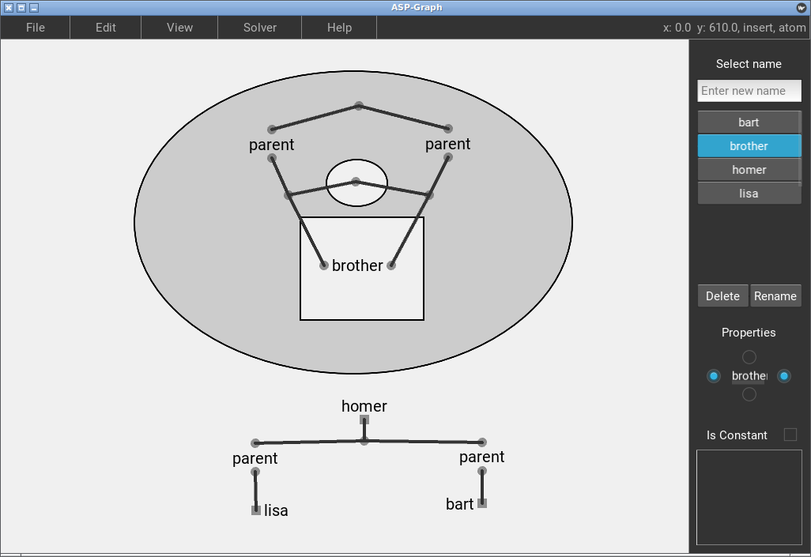
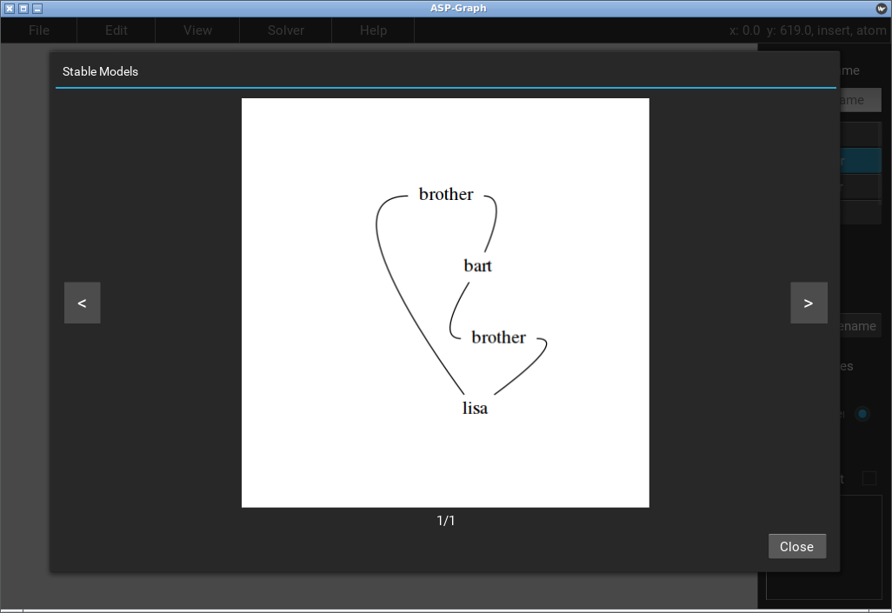

# *Grasp*

*Grasp* is a visual tool for logic programming within the Answer Set Programming paradigm (ASP). Its aim is to provide a diagrammatic alternative to the traditional symbolic reasoning used when creating logic programs. It is based on a diagrammatic reasoning system known as "Existential Graphs", introduced by Charles S. Peirce in the late 20th century.

Uses the [Potsdam Answer Set Solving Collection](https://potassco.org/) as back-end and [PyGraphviz](https://pygraphviz.github.io/) for showing results. GUI made with the [Kivy library](https://kivy.org).

At the moment, *Grasp* runs only on GNU/Linux.

## Features
- Formalize ASP theories in a visual manner with Equilibrium Graphs (an Existential Graphs extension for ASP).
- Create/Edit Alpha (propositional) and Beta (first-order) Equilibrium Graphs.
- Semantic approach to graph edition.
- Save/Load graph.
- Export graph to bitmap image or ASP code.
- View the symbolic equivalent of a graph.
- Integration with POTASSCO system in order to find the stable models of a graph.
- In-app tutorial.

## Usage

The interface has three main parts:

	- Main Menu Bar: Traditional menu bar with all available functions.
	- Canvas: The place to draw diagrams.
	- Side Panel: Used for managing names and predicate properties.

The canvas has two operating modes: SELECT and INSERT. Graph creation is done entirely with the mouse. The keyboard is only used for shortcuts.

| Mode    | Left-Click | Right-Click | Middle Button | Scroll |
|:-------:|:----------:|:-----------:|:-------------:|:------:|
| INSERT  | Add item   | Delete item | Pan           | Zoom   |
| SELECT  | Move item  | Resize item | Pan           | Zoom   |

## Shortcuts

| Key     | Action           |
|---------|-----------------:|
| D       | INSERT Mode      |
| S       | SELECT Mode      |
| W       | Literal          |
| E       | Ellipse          |
| R       | Rectangle        |
| T       | Toggle Panel     |
| TAB     | Focus name input |
| ESC     | Quit             |

# Screenshots

